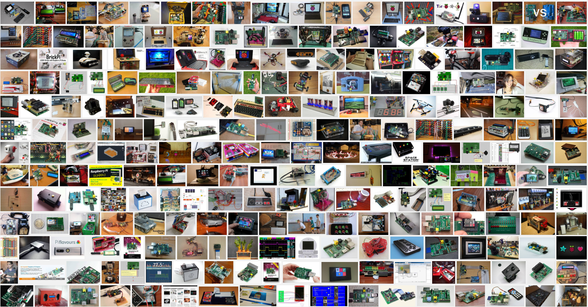
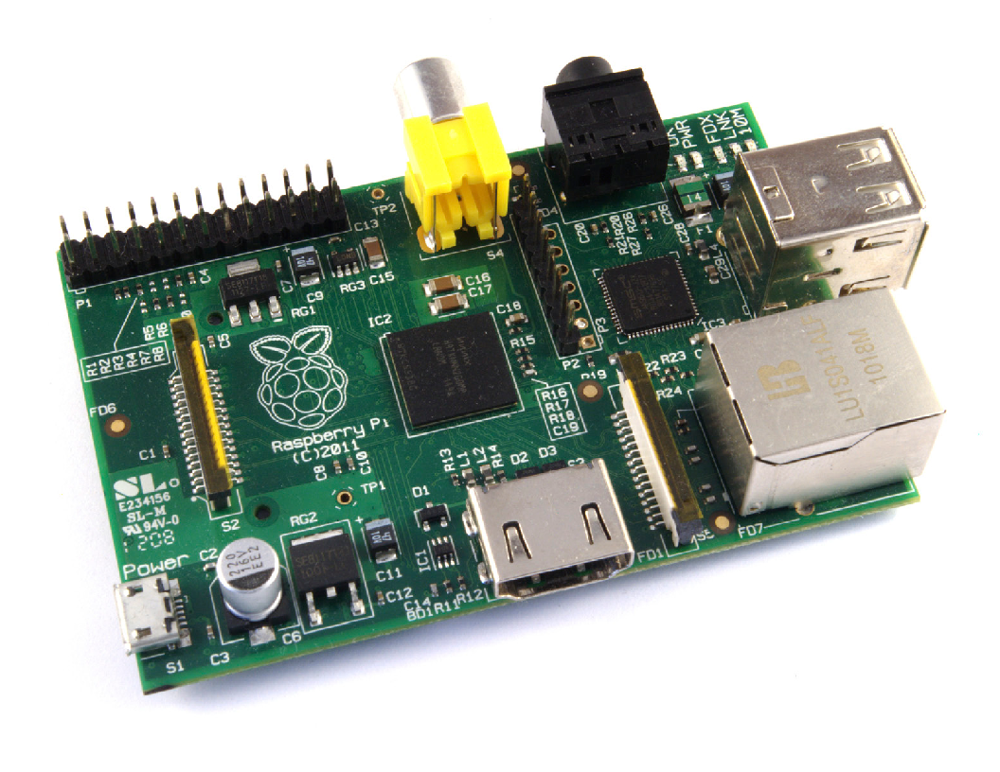

Introducción al Raspberry Pi
===========================


##	¿Qué es un Raspberry pi?

1. Es un ordenador de placa reducida de bajo coste.
2. Nació para estimular la enseñanza de ciencias de la computación en las escuelas del Reino Unido( plataforma educativa).
3. Actualmente es una plataforma de desarrollo.



####Recursos

- SoC: Broadcom BCM2835 (CPU + GPU + DSP + SDRAM + puerto USB)
- CPU: ARM 1176JZF-S a 700 MHz (familia ARM11)
- Juego de instrucciones: RISC de 32 bits
- GPU: Broadcom VideoCore IV, OpenGL ES 2.0, MPEG-2 y VC-1 (con licencia), 1080p30 H.264/MPEG-4 AVC
- Memoria (SDRAM): 512 MiB (compartidos con la GPU)
- Puertos USB 2.0: 4
- Entradas de video: Conector MIPI CSI que permite instalar un
- módulo de cámara desarrollado por la RPF
- Salidas de video: Conector RCA (PAL y NTSC), HDMI (rev1.3 y 1.4), Interfaz DSI para panel LCD
- Salidas de audio: Conector de 3.5 mm, HDMI
- Almacenamiento integrado: MicroSD
- Conectividad de red: 10/100 Ethernet (RJ-45) via hub USB
- Periféricos de bajo nivel: GPIO, SPI, I2C, UART
- Consumo energético: 600 mA, (3.0 W)
- Fuente de alimentación: 5V v´ıa Micro USB o GPIO header
- Dimensiones: 85.60mm × 53.98mm
- Sistemas operativos soportados:GNU/Linux: Debian (Raspbian), Fedora (Pidora), Arch Linux (Arch Linux ARM), Slackware Linux. RISC OS

#### Modelos

##### RPI 1 Modelo A


##### RPI 1 Modelo A+


##### RPI 1 Modelo B


##### RPI 1 Modelo B+


##### RPI 2 Modelo B


##### RPI ZERO


##### RPI 3 Modelo B


|               |RPI 1 Model A		|RPI 1 Model A+	 	|RPI 1 Model B		|RPI 1 Model B+	|RPI Model 2 Model B| RPI Zero| RPI 3 Model B|
|---------------|:-------------:|:-------------:|:-------------:|:-----------:|:-------------:|:--------------:|:-------:|
|SoC|	Broadcom BCM2835| Broadcom BCM2835|Broadcom BCM2835|Broadcom BCM2835|Broadcom BCM2836| Broadcom BCM2835|BCM287 |
|CPU| ARMv6 700 MHz| ARM11 ARMv6 700 MHz| ARM11 ARMv6 700 MHz| ARM11 ARMv6 700 MHz| ARM11 ARMv7 ARM Cortex-A7 4 núcleos @ 900 MHz| ARM11 ARMv6 Dual Core 1 GHz| ARM cortex A53 1.2GHz 64bit 4 núcleos|
|GPU|Broadcom VideoCore IV 250 MHz. OpenGL ES 2.0 |Broadcom VideoCore IV 250 MHz. OpenGL ES 2.0| Broadcom VideoCore IV 250 MHz. OpenGL ES 2.0| Broadcom VideoCore IV 250 MHz. OpenGL ES 2.0	| Broadcom VideoCore IV 250 MHz. OpenGL ES 2.0| Broadcom VideoCore IV 250 MHz. OpenGL ES 2.0|Broadcom VideoCore IV 250 MHz. OpenGL ES 2.0 |
|RAM| 256 MB LPDDR SDRAM 400 MHz| 256 MB LPDDR SDRAM 400 MHz| 512 MB LPDDR SDRAM 400 MHz| 512 MB LPDDR SDRAM 400 MHz| 1 GB LPDDR2 SDRAM 450 MHz| 512 MB LPDDR SDRAM 400 MHz| 1 GB LPDDR2 SDRAM 450 MHz|
|USB| 1 USB 2.0|1 USB 2.0|2 USB 2.0|4 USB 2.0|4 USB 2.0| 1 microUSB 2.0| 4 USB 2.0|
|Salidas de vídeo|HDMI 1.4 @ 1920x1200 píxeles|HDMI 1.4 @ 1920x1200 píxeles|HDMI 1.4 @ 1920x1200 píxeles|HDMI 1.4 @ 1920x1200 píxeles|HDMI 1.4 @ 1920x1200 píxeles|mini-HDMI 1.4 @ 1920x1200 píxeles | HDMI 1.4 @ 1920x1200 píxeles |
|Almacenamiento|SD/MMC|microSD|SD/MMC|microSD|microSD|microSD| microSD|
|Ethernet|No|No|Sí, 10/100 Mbps|Sí, 10/100 Mbps|Sí, 10/100 Mbps| No | 10/100 Mbit/s Ethernet 802.11n wireless Bluetooth 4.1 |
|Tamaño	|85,60mmx56,5 mm|65mmx56,5 mm|85,60mmx56,5 mm|85,60mmx56,5 mm|85,60mmx56,5 mm|65mmx30mm|85,60mmx56,5 mm|
|Peso   |45 g.|23 g.|45 g.|45 g.|45 g.|9 g| 45g|
|Precio	|25 dólares|20 dólares|35 dólares|35 dólares|35 dólares|5 dólares| 35 dólares|


## Relación con otros ordenadores

## Herramientas

### Windows

- Win32DiskImager [(Descargar)](http://sourceforge.net/projects/win32diskimager/files/latest/download
)
- Putty [(Descargar)](https://the.earth.li/~sgtatham/putty/latest/x86/putty-0.67-installer.msi)
- WinSCP [(Descargar)](https://winscp.net/eng/download.php#download2)
- Advanced IP Scanner [(Descargar)](http://www.filehippo.com/download_advanced_ip_scanner/?utm_source=FT&utm_medium=Redirect&utm_campaign=AIS)
- SDFormater [(Descargar)](https://www.sdcard.org/downloads/formatter_4/eula_windows/SDFormatterv4.zip)

### Linux

```console
$ sudo dd bs=4M if=/path/of/raspbian-image.img of=/dev/mmcblk0
$ sudo apt-get -y install nmap
$ sudo nmap -sn ip.of.red.0/24
$ ssh pi@your.rpi.ip.address
$ scp your_archivo pi@your.rpi.ip.address:"/home/pi"
```

## Materiales

- MicroSD
- Cable ethernet
- Fuente de 5V 2amp
- Raspberry pi
- PC
- Software Putty
- Cable HDMI(opcional)
- Teclado(opcional)
- Mouse(opcional)
- Usb Wifi(opcional)

### Instalacion de SO

1. SO Raspbian, descargarlo de la página oficial de Raspberry Pi desde [aquí](https://www.raspberrypi.org/downloads/raspbian/)
2. una memoría microSD de al menos 4Gb (recomiendo que sea de clase 10)
3. software para grabar el SO en la memoria microSD, en este caso optaremos por Win32DiskImager

El usuario por defecto es **pi** y la contraseña **raspberry**

### Primera conexión:

Formaremos una red local entre el Rpi y la PC para poder acceder a esta sin necesidad de una pantalla y teclado ni demás conectores.Los materiales que se necesitaremos son:

Despues de grabar la memoría microSD con Raspbian, lo insertamos en la pc y vamos a editar el archivo cmdline.txt:

```
 $ nano boot/cmdline.txt
 dwc_otg.lpm_enable=0 console=ttyAMA0,115200 <...> rootwait ip=your.rpi.ip.address
```

Luego insertamos la memoria en el raspberry pi, y alimentamos la raspberry pi, en paralelo cambiamos la configuración de ethernet en nuestra PC con la siguiente configuración:

```
$ ip address: your.rpi.ip.another_address
$ netmask: 255.255.255.0
$ gateway: your.rpi.ip.address
```

Y conectamos la Rpi con la PC mediante el cable ethernet, y abrimos el programa Putty y colocaremos la ip del raspberry pi, aceptamos la llave SSH y colocamos el usuario:pi y la contraseña:raspberry cuando nos pidan. Luego de esto configuramos una mejor conexión ya sea cableada o inalámbrica.

Desde [https://www.raspberrypi.org/documentation/remote-access/ssh/](https://www.raspberrypi.org/documentation/remote-access/ssh/) :

> As of the November 2016 release, Raspbian has the SSH server disabled by default.
>  You will have to enable it manually. This is done using raspi-config: 
> Enter sudo raspi-config in the terminal, first select Interfacing options, then navigate to  ssh, press
> Enter and select Enable or disable ssh server.
> For headless setup, SSH can be enabled by placing a file named 'ssh', without any extension, onto the boot partition of the SD card.

##### RASPBIAN JESSIE LITE

Segun un aviso de la actualización, se removio el acceso ssh por defecto por lo que no se podrá seguir el manual para versiones posteriores a Noviembre del 2016.

En los foros nos muestra una solución para la version Lite de raspbian. Primero debemos ingresar al archivo cmdline.txt añadir lo siguiente:
```
ip=192.168.1.200::192.168.1.1:255.255.255.0:rpi:eth0:off
```
Esta estructuta tiene la forma: 
```
ip=<client-ip>:<server-ip>:<gw-ip>:<netmask>:<hostname>:<device>:<autoconf>
```

Despues de esto para habilitar la conexión ssh solo es necesario crear un archivo vacio  llamado ***ssh*** o ***ssh.txt***.

En el caso de nuestra computadora debemos configurarlo como:

```
$ ip address: 192.168.1.xxx
$ netmask: 255.255.255.0
$ gateway: 192.168.1.1
```

**Nota**: La creación del archivo ***ssh*** o ***ssh.txt*** habilta el protócolo ssh en 
***RASPBIAN JESSIE WITH PIXEL*** pero la configuración de ip estática genera que el boot no se complete.

#### Cableada(IP Dinámica)

No editamos nada pero necesitaremos un software que escanee la red como Advanced IP Scanner donde buscaremos la red que tenga como fabricante a Raspberry Pi Foundation.

#### Cableada(IP Estática)

Editamos el archivo interfaces:

```
$ sudo nano /etc/networks/interfaces
```

y cambiamos a:

```
 auto eth0
 #iface eth0 inet dhcp
 iface eth0 inet static
 address 192.168.1.11
 netmask 255.255.255.0
 gateway 192.168.1.1 #dirección ip del router
```

#### Inalámbrica

 Editamos el archivo wpa_supplicant.conf:&nbsp:

```
$ sudo nano /etc/wpa_supplicant/wpa_supplicant.conf
```
y cambiamos a:

```
network={
    ssid="Your ssid"
    psk="your wifi password"
}
```

En ambos casos reiniciar la Rpi y conectarse ahora por el nuevo IP a través del cliente SSH, en nuestro caso Putty(en el caso de una red inalámbrica averigue su IP con Advanced IP Scanner )

Si la Raspberry Pi tiene acceso a internet comprobamos si esta bien configurado con el siguiente comando:
```
$ ping -c 3 8.8.8.8
PING 8.8.8.8 (8.8.8.8) 56(84) bytes of data.
64 bytes from 8.8.8.8: icmp_seq=1 ttl=45 time=173 ms
64 bytes from 8.8.8.8: icmp_seq=2 ttl=45 time=180 ms
64 bytes from 8.8.8.8: icmp_seq=3 ttl=45 time=172 ms
--- 8.8.8.8 ping statistics ---
3 packets transmitted, 3 received, 0% packet loss, time 2002ms
rtt min/avg/max/mdev = 172.677/175.469/180.461/3.554 ms
```

Y sino tendremos que configurar el DNS, para ello editamos el archivo /etc/resolv.conf

```
$ sudo nano /etc/resolv.conf
nameserver 8.8.8.8
nameserver 8.8.4.4
```

Con ello ya deberiamos poder acceder a internet, comprobamos ello con el comando anteriormente descrito

##	Introducción al S.O. GNU-Linux

Linux, es un kernel, es decir, el núcleo de un Sistema Operativo, mientras que GNU/Linux, el Sistema Operativo que utiliza el Kernel Linux como núcleo, creado, difundido y promovido a través del Proyecto GNU, por la Free Software Foundation, organización sin fines de lucro, fundada por Richard Stallman, principal precursor del Software Libre.

El Kernel Linux, parte fundamental del Sistema Operativo, fue desarrollado por Linus Torvals, utilizando como modelo a UNIX. Una de las diferencias fundamentales entre los núcleos Linux y UNIX, es que el primero, es Software Libre, mientras que el segundo no lo es.

Por otra parte, mientras existe un único Kernel Linux (con versiones diferentes), existen decenas y hasta cientos de distribuciones GNU/Linux, es decir, diferentes Sistemas Operativos basados en el Kernel Linux, entre las cuales se destacan: Debian, Ubuntu, Lbuntu, Fedora, Gentoo, Slackware, CentOS, ArchLinux, Asturix, entre otros cientos.

Un sistema Linux reside bajo un árbol jerárquico de directorios muy similar a la estructura del sistema de archivos de plataformas Unix.

Originariamente, en los inicios de Linux, este árbol de directorios no seguía un estándar cien por cien, es decir, podíamos encontrar diferencias en él de una distribución a otra.

Todo esto hizo pensar a la comunidad que, posteriormente, desarrollarían el proyecto FHS (Filesystem Hierarchy Standard) en 1993.

Los Objetivos de FHS son:

- Presentar un sistema de archivos coherente y estandarizado.
- Facilidad para que el software prediga la localización de archivos y directorios instalados.
- Facilidad para que los usuarios prediga la localización de archivos y directorios instalados.
- Especificar los archivos y directorios mínimos requeridos.

Este estandár esta enfocado a:

- Fabricantes de software independiente y creadores de sistemas operativos, para que establezcan una estructura de ficheros lo más compatible posible.
- Usuarios comunes, para que entiendan el significado y el contendido de cada uno de los elementos del sistema de archivos

Otro concepto muy importante es que en Linux todo es un archivo.

### Organización de Archivos
#### El directorio raiz (/)

Todo surge a partir del directorio raíz (/).

El contenido de este directorio debe ser el adecuado para reiniciar, restaurar, recuperar y/o reparar el sistema, es decir, debe proporcionar métodos, herramientas y utilidades necesarias para cumplir estas especificaciones.

##### Contenido del directorio raíz:
#####	/bin

En este directorio se ubica el código binario o compilado de los programas y comandos que pueden utilizar todos los usuarios del sistema.

La denominación es clara, bin de BINARY (binario en castellano).

No debe haber subdirectorios en /bin.

##### /boot

Este directorio contiene todo lo necesario para que funcione el proceso de arranque del sistema.

/boot almacena los datos que se utilizan antes de que el kernel comience a ejecutar programas en modo usuario.

El núcleo del sistema operativo (normalmente se guarda en el disco duro como un fichero imagen llamado vmlinuz-versión _ núcleo) se debe situar en este directorio o, en el directorio raíz.

El núcleo tiene la capacidad de crear dos entornos o modos de ejecución totalmente separados.

Uno de ellos está reservado para el propio kernel, denominado el modo núcleo; y el otro está reservado para el resto de programas, llamado el modo usuario.

Realmente se crean dos entornos totalmente separados, es decir, cada uno tiene su propia zona de memoria y procesos independientes.

Démonos cuenta que esta técnica ofrece mucha seguridad y estabilidad al sistema.

Cuando un proceso del modo usuario necesita recursos del modo kernel (por ejemplo, acceder a la memoria USB) se hacen uso de las famosas llamadas al sistema (interface que ofrece el núcleo para la comunicación del modo usuario con el modo kernel).

#####  /dev

Este directorio almacena las definiciones de todos los dispositivos. Como se ha mencionado, cada dispositivo tiene asociado un archivo especial.

Por ejemplo, el contenido de la sexta partición del disco duro será /dev/hda5.

El fichero asociado al ratón tipo PS/2 será /dev/psaux.

Además, es importante saber que los dispositivos pueden ser de bloque o de carácter.

Normalmente los dispositivos de bloque son los que almacenan datos y, los de carácter los que transfieren datos.

En definitiva, la estructura de este directorio es algo complejo. Podríamos dedicar otro artículo entero para poder explicar en profundidad el contenido y funcionamiento especifico del directorio /dev. De momento nos vasta con saber que Linux lo utiliza para asociar dispositivos (devices) con ficheros.

NOTA: El subdirectorio /dev/null es como un agujero negro. Esto es así, puesto que cualquier dato que se almacena aquí, desaparece. Es muy útil para redireccionar los errores por ejemplo:

##### /etc

El directorio /etc contiene archivos necesarios para configuración del sistema.

Archivos que son propios del ordenador y que se utilizan para controlar el funcionamiento diversos programas.

Deben ser ficheros estáticos y nunca pueden ser archivos binarios y/o ejecutables.

Algunos subdirectorios contenidos en /etc:

* X11. Subdirectorio para la configuración del sistema de ventanas. Es opcional.

* SGML. Subdirectorio para la configuración de SGML. Es opcional.

* Xml. Subdirectorio para la configuración de XML. Es opcional.

* X11 Sistema de ventanas graficas originario de UNIX en su versión 11. Este sistema tiene la peculiaridad de ser totalmente independiente del sistema operativo. Es una estructura cliente-servidor.

* XML - eXtensible Markup Language (lenguaje de marcas extensible). Es un metalenguaje de etiquetas.

* SGML - Standard Generalized Markup Language (Lenguaje de Marcación Generalizado). Sistema para la organización y etiquetado de documentos.

En definitiva, /etc mantiene los archivos de configuración del sistema para un ordenador específico.

###### /home

Directorio que contiene los subdirectorios que son directorios origen para cada uno de los usuarios del sistema.

Cada subdirectorio /home/user de cada usuario proporciona el lugar para almacenar sus ficheros, así como los archivos de configuración propios de cada uno.

Es importante saber que también algunos servicios, y no solo usuarios, crean aquí su directorio origen, por ejemplo: el servicio de transferencia de ficheros (FTP).

El administrador tiene su propio directorio home, que es /root.

#####   /lib

El directorio /lib contiene librerías compartidas (similar a las dlls para los usuarios de Windows) necesarias para arrancar el sistema y para los ficheros ejecutables contenidos en, por ejemplo, /bin.

Normalmente las librerías son ficheros binarios escritos en lenguaje C.

También contiene módulos del kernel esenciales que permiten el funcionamiento de muchos elementos Hardware. Se ubicarán normalmente en /lib/modules/versión-del-kernel/.

En el apartado /usr/include se explica que son y como funcionan las librerías y los archivos cabecera.

#####  /media

Este directorio contiene los subdirectorios que se utilizan como puntos del montaje para los medios de almacenamiento, tales como disquetes, CD-ROM y memorias USBs.

##### /mnt

Este directorio contiene sistemas de archivos externos que hayan sido montados.

Las entidades que aparecen dentro de /mnt representan recursos externos a los que se puede acceder a través de este directorio.

##### /opt

En este directorio (/opt de options, u opciones en castellano) se suelen instalar complementos o add-ons de los programas.

Las aplicaciones crean un subdirectorio dentro de /opt denominado con el mismo nombre del programa.

##### /root

Este directorio es el directorio /home del administrador del sistema (root).

##### /sbin

Los programas y comandos que se utilizan para la administración del sistema se almacenan en /sbin, /usr/sbin y /usr/local/sbin.

/sbin únicamente contiene los ejecutables esenciales para el arranque, recuperación y reparación del sistema.

Todos estos directorios (/sbin, /usr/sbin y /usr/local/sbin) se utilizan con fines administrativos, por tanto, sólo puede ejecutar su contenido el administrador.

##### /srv

Contiene los archivos de datos específicos para cada servicio instalado en el sistema.

##### /tmp

En este directorio se guardan los archivos temporales.

#### El directorio /usr

Es la segunda sección más grande o estructura jerár quica (después del directorio raíz) del sistema de ficheros.

Este directorio está pensado para almacenar datos que se puedan compartir con otros hosts.

Estos datos además deben ser inalterables, es decir, sólo de lectura.

Normalmente, este directorio tiene su partición propia.

Comúnmente, se almacena aquí el software instalado en el sistema.

##### Estructura de /usr

##### /usr/bin

Éste es el directorio primario de comandos ejecutables del sistema.

/usr/bin alberga los archivos ejecutables vinculados al software instalado en el sistema.

##### /usr/include

Linux está escrito en lenguaje C.

En C es posible utilizar funciones que ya estén predefinidas (como otros muchos lenguajes de programación) para incluirlas en el programa que estemos haciendo. Esta técnica se denomina programación modular.

Estas funciones se llaman comúnmente archivos cabecera (.h de header) y contienen las declaraciones externas de una librería.

La manera de incluir estos archivos cabecera en nuestro programa, es haciendo uso de la directiva include; de ahí la denominación del subdirectorio.

Todos estos ficheros cabecera (que necesite el software instalado en el sistema) se almacenan en este subdirectorio.

*Una librería no es más que un programa compilado, donde originariamente se implemento el código fuente de las funciones que la componen.

La declaración pública del conjunto de funciones de la librería reside en los archivos cabecera.

Vemos parte de su contenido:


##### /usr/lib

Este directorio incluye librerías compartidas y ficheros binarios pensados para no ser ejecutados directamente por los usuarios del sistema.

##### /usr/local/

/usr/local/ es para uso del administrador del sistema cuando instala software localmente. Puede usarse para programas y datos que son compartibles entre un grupo de máquinas

Este subdirectorio tiene una estructura similar a la del directorio /usr.


##### /usr/sbin

Este directorio contiene comandos y programas no esenciales usados exclusivamente por el administrador de sistema.

Como se ha comentado, los comandos necesarios para la reparación, recuperación y otras funciones esenciales del sistema, se almacenan en /sbin.


#####  /usr/src

Por lo general, en /usr/src (src de source o, fuente en castellano) se guarda el código fuente del Kernel del sistema.

Para comprobar si tenemos en nuestra distribución los fuentes del kernel instalados, deberíamos ver un enlace simbólico llamado linux.

#### El directorio /var

Este directorio va ha contener ficheros de datos variables y temporales, así como archivos spool (ficheros almacenados en fila en espera a ejecutarse, como por ejemplo colas de impresión).

Todos los log del sistema y los generados por los servicios instalados, se ubican dentro de la estructura jerárquica de /var. Esto quiere decir que el tamaño global de este directorio va ha crecer constantemente.

La utilidad de /var radica en poder detectar problemas para prevenirlos y solucionarlos.

Es aconsejable montar en una nueva partición este directorio. Si no se pudiera, es preferible ubicar /var fuera de la partición raíz y de la partición /usr.

##### Distribución de algunos subdirectorios de /var

##### /var/cache

Subdirectorio pensado para albergar datos de aplicaciones en cache (usados en un espacio breve de tiempo).

El sistema de paquetes de Debian (apt-get), mantiene y almacena todos los paquetes que nos hemos instalado con el gestor de paquetes Apt-get. Por ejemplo, si ejecutamos:

```
pi@raspberry:# apt-get install nmap
```

Debian se bajará de algún repositorio especificado en /etc/apt/sources.list el archivo nmap_version.deb, lo almacenará en /var/cache/apt y lo instalará desde esta ruta.

Posteriormente lo podemos borrar. Por defecto Debian almacena aquí todo los paquetes que nos hemos instalado con su gestor de paquetes Apt-get.

##### /var/lib

Encontramos aquí información sobre el estado variable de las aplicaciones.

##### /var/lock

Aquí se almacenan los ficheros que están bloqueados por el sistema.

##### /var/log

En /var/log se guardan los mensajes de registro generados por el sistema operativo y por diversos servicios.

Por ejemplo:

En /var/log/messages son los logs generados por el kernel, en /var/log/httpd/access_log encontramos quien (desde que ip) está accediendo a nuestro servidor Web y, en /var/log/wtmp encontraremos todos los accesos y salidas en el sistema.

##### /var/mail

Linux enviará aquí los archivos de correos de cada usuario del sistema.

##### /var/run

/var/run contiene archivos con información del sistema que lo describen desde que se arrancó. Generalmente, se borrará todos los archivos que cuelgan de este subdirectorio al comenzar el proceso de arranque.

Estos archivos con información del sistema son los llamados archivos identificados de procesos” ó PID, que guardan el identificador del proceso (Process ID).

Podemos ver aquí los archivos PID en un instante determinado en mi máquina:


##### /var/spool

/var/spool contiene ficheros almacenados en forma de fila de trabajos, para un procesamiento posterior.

Un ejemplo claro puede ser los trabajos que guarda la impresora para, posteriormente, ejecutarlos por un orden de llegada y/o prioridad.

##### /var/tmp

Algunos datos temporales se almacenan aquí y que, posiblemente, pueden aparecer en nuestra distribución GNU/Linux para no saturar el directorio /tmp.

Existen otra serie de directorios que no especifica el estándar FSH, pero que son importantes.

##### Directorio /lost+found. Perdidos y encontrados

Las herramientas y utilidades para restaurar y/o reparar el sistema de archivos almacenan los datos en este directorio.

Es un espacio temporal donde se guardan los datos que se recuperan después de una caída del sistema.

Fijémonos que, normalmente en cada partición que creemos existirá un /lost+found en el nivel superior.

Por último, decir que este directorio existe sólo en distribuciones que tengan como sistemas de archivos ext2 o ext3.

##### Directorio /proc
/proc es un sistema de archivos virtual. Se genera y actualiza dinámicamente, es decir,

no se mantiene en el disco duro, se mantiene el la memoria RAM. Es el sistema quien lo crea y lo destruye.

Este directorio contiene información sobre los procesos, el núcleo e información relativa al sistema.

###	Comandos en GNU-Linux

Algunos de los miles de comandos de linux!!!

| Comando 	|Función 			| Uso 								|
|-----------|-------------------|-----------------------------------
|man 		|manual  			| ``$ man man``						|
|ls 		|listing 			| ``$ ls /home/pi``					|
|cd 		|change directory	| ``$ cd ..``						|
|mv 		|move 				|``$ mv carpeta1 carpeta2``			|
|rm 		|remove 			|``$ rm archivo.txt``				|
|rmdir 		|remove directory 	|``$ rmdir carpeta``				|
|mkdir 		|make directory 	|``$ mkdir carpeta``				|
|cp 		|copy 				|``$ cp archivo1.txt archivo2.txt``	|
|find 		|find 				|``$ find archivo.txt``				|
|locate 	|locate 			|``$ locate archivo.txt``			|

##	Uso del editor Nano
```sh
$ nano name_of_file
```

## raspi-config

La herramienta Raspi-config le ayuda a configurar su Raspberry Pi; varios ajustes se pueden cambiar con esta herramienta sin tener que conocer los comandos correctos para su uso.

```console
$ sudo raspi-config
```


## Escritorio Remoto: VNC

```console
$ sudo apt-get install tightvncserver
$ vncserver :1 -geometry 1280x800 -depth 16 -pixelformat rgb565
```

Para windows descargar desde [aquí](https://www.realvnc.com/download/binary/1795/)

Para linux instalar:
```console
$ sudo apt-get -y install 
```

ingresar con **your.rpi.ip.address:1**


## Editor remoto: Sublime

Usar la terminal para editar no es amigable, por ello recurrimos a esta gran utilidad.

### Instalar sublime

1. Instalar sublime desde [aquí](https://download.sublimetext.com/Sublime%20Text%202.0.2a%20x64%20Setup.exe)
2. Instalar Package Control
	Ejecutar View/Console y pegar
```perl
import urllib2,os,hashlib; h = '2915d1851351e5ee549c20394736b442' + '8bc59f460fa1548d1514676163dafc88'; pf = 'Package Control.sublime-package'; ipp = sublime.installed_packages_path(); os.makedirs( ipp ) if not os.path.exists(ipp) else None; urllib2.install_opener( urllib2.build_opener( urllib2.ProxyHandler()) ); by = urllib2.urlopen( 'http://packagecontrol.io/' + pf.replace(' ', '%20')).read(); dh = hashlib.sha256(by).hexdigest(); open( os.path.join( ipp, pf), 'wb' ).write(by) if dh == h else None; print('Error validating download (got %s instead of %s), please try manual install' % (dh, h) if dh != h else 'Please restart Sublime Text to finish installation')
```
3. Ejecutar ctrl-shift-p, escribir install y seleccionar rsub

### Instalar rmate

```bash
$ sudo wget -O /usr/local/bin/rsub https://raw.github.com/aurora/rmate/master/rmate
$ sudo chmod +x /usr/local/bin/rsub
```

### Configurar Putty

1. Ejecutar como administrador putty
2. Seleccionar Connection/SSH/tunnels
3. Colocar en **Source port**: 52698, en **Destination**:127.0.0.1:52698 y seleccionar **Remote**

### USO

```bash
$ rsub your_file
```

[[Anterior]](../README.md)   [[Siguente]](../clase02/clase.md)
