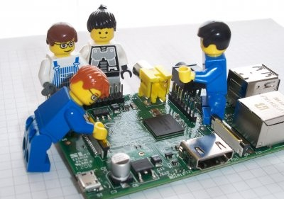
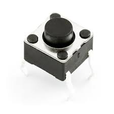

Manejo de los GPIO's
==================



## Instalación
```bash
$ sudo apt-get -y update
$ sudo apt-get -y upgrade
$ sudo apt-get -y install python-dev
$ sudo apt-get -y install python-rpi.gpio
```

## Datasheet


## Uso de GPIO con Python

### LED

> Un led es un componente electrónico cuya función principal es convertir la energía eléctrica en una fuente luminosa, la palabra led proviene del acrónimo ingles Light Emmiting Diode o diodo emisor de luz.


####Blink
```python
#!/usr/bin/python
import RPi.GPIO as GPIO
import time
led = 18  #GPIO18
delay = 1 #one second
GPIO.setwarnings(False) #disable warnings
GPIO.setmode(GPIO.BCM) # mode BCM or Board
GPIO.setup(led, GPIO.OUT) # input or output
while True:
	GPIO.output(led, True)
    time.sleep(delay)
    GPIO.output(led, False)
    time.sleep(delay)
```


####PWM
```python
#!/usr/bin/python
import RPi.GPIO as GPIO
import time
led = 18  #GPIO18
GPIO.setwarnings(False) #disable warnings
GPIO.setmode(GPIO.BCM) # mode BCM or Board
GPIO.setup(led, GPIO.OUT) # input or output
pwm_led = GPIO.PWM(led, 500)
pwm_led.start(100)
while True:
    duty_s = raw_input("Enter Brightness (0 to 100): ")
    duty = int(duty_s)
    pwm_led.ChangeDutyCycle(duty)
```


#### Pulsador

>Los pulsadores (PUSHBUTTONS), son interruptores que al ser accionados de forma manual cambian de estado y al soltarlo regresan a su estado inicial


```python
#!/usr/bin/python
import RPi.GPIO as GPIO
import time
led = 18  #GPIO18
delay = 0.2 #0.2 seconds
GPIO.setwarnings(False) #disable warnings
GPIO.setmode(GPIO.BCM) # mode BCM or Board
GPIO.setup(led, GPIO.IN, pull_down=GPIO.PUD_UP) # input or output
while True:
    input_state = GPIO.input(led)
    if input_state == False:
        print("Button Pressed")
    time.sleep(delay)
```


#### Pulsador II

```python
#!/usr/bin/python
import RPi.GPIO as GPIO
import time
led = 18  #GPIO18
switch = 23
GPIO.setwarnings(False) #disable warnings
GPIO.setmode(GPIO.BCM) # mode BCM or Board
GPIO.setup(led, GPIO.OUT) # input or output
GPIO.setup(switch, GPIO.IN, pull_up_down=GPIO.PUD_UP)
led_state = False
old_input_state = True
while True:
    new_input_state = GPIO.input(switch)
    if new_input_state == False  and old_input_state == True:
        led_state = not led_state
    old_input_state = new_input_state
    GPIO.output(led, led_state)
```

#### Ultrasonido

>	Los sensores de ultrasonidos o sensores ultrasónicos son detectores de proximidad que trabajan libres de roces mecánicos y que detectan objetos a distancias que van desde pocos centímetros hasta varios metros. El sensor emite un sonido y mide el tiempo que la señal tarda en regresar. Estos reflejan en un objeto, el sensor recibe el eco producido y lo convierte en señales eléctricas, las cuales son elaboradas en el aparato de valoración


```python
import RPi.GPIO as GPIO
import time
GPIO.setmode(GPIO.BCM)
TRIG = 23
ECHO = 24
print "Distance Measurement In Progress"
GPIO.setup(TRIG,GPIO.OUT)
GPIO.setup(ECHO,GPIO.IN)
GPIO.output(TRIG, False)
print "Waiting For Sensor To Settle"
time.sleep(2)
GPIO.output(TRIG, True)
time.sleep(0.00001)
GPIO.output(TRIG, False)
while GPIO.input(ECHO)==0:
	pulse_start = time.time()
while GPIO.input(ECHO)==1:
	pulse_end = time.time()
pulse_duration = pulse_end - pulse_start
distance = pulse_duration * 17150
distance = round(distance, 2)
print "Distance:",distance,"cm"
GPIO.cleanup()
```


#### Servomotor

>	Un servomotor (también llamado servo) es un dispositivo similar a un motor de corriente continua que tiene la capacidad de ubicarse en cualquier posición dentro de su rango de operación, y mantenerse estable en dicha posición.


```python
from Tkinter import *
import RPi.GPIO as GPIO
import time
GPIO.setmode(GPIO.BCM)
GPIO.setup(18, GPIO.OUT)
pwm = GPIO.PWM(18, 100)
pwm.start(5)
class App:
	def __init__(self, master):
	frame = Frame(master)
	frame.pack()
	scale = Scale(frame, from_=0, to=180, orient=HORIZONTAL, command=self.update)
	scale.grid(row=0)
	def update(self, angle):
		duty = float(angle) / 10.0 + 2.5
		pwm.ChangeDutyCycle(duty)

root = Tk()
root.wm_title('Servo Control')
app = App(root)
root.geometry("200x50+0+0")
root.mainloop()
```

#### DHT22

## Instalación
```bash
$ sudo apt-get -y update
$ sudo apt-get -y install python-pip
$ sudo pip install adafruit_python_dht
```

```python
import Adafruit_DHT
import time

while True:
	humidity, temperature = Adafruit_DHT.read_retry(Adafruit_DHT.DHT22, 4)
	if humidity is not None and temperature is not None:
    		print('Temp={0:0.1f}*  Humidity={1:0.1f}%'.format(temperature, humidity))
	else:
    		print('Failed to get reading. Try again!')

	time.sleep(1)

```

### Resumen

	sudo apt-get install -y update
	sudo apt-get install -y upgrade
	sudo apt-get install -y install python-dev
	sudo apt-get install -y python-rpi.gpio
	sudo apt-get install -y python-pip
	sudo pip install adafruit_python_dht

[[Anterior]](../clase01/clase.md)   [[Siguente]](../clase03/clase.md)
