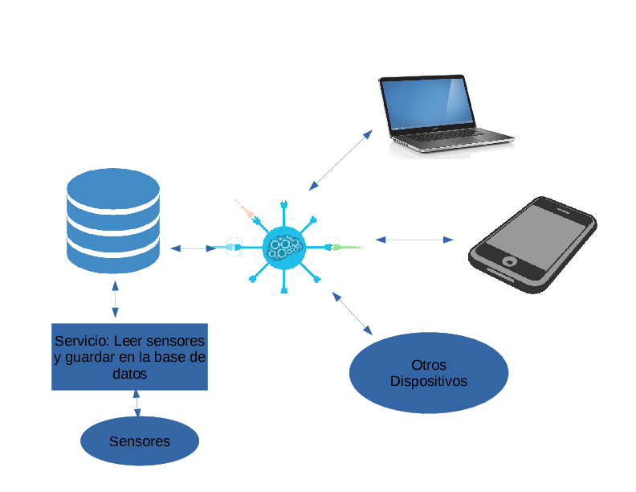
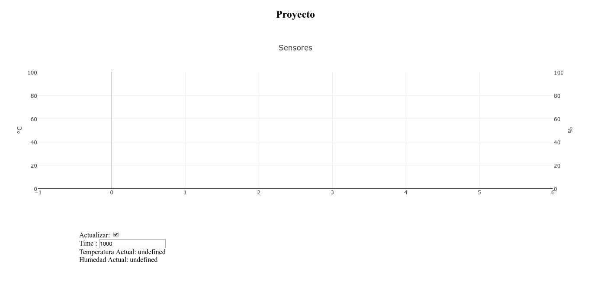

Servidores y Bases de Datos con Raspberry
==========================================

## Introducción a redes y servidores
## Uso de sockets
## Instalación y configuración de un servidor web en Raspberry pi
## Control de la Raspberry pi a través de una página web.

El proyecto que se implementará consiste en el monitoreo de sensores y control de actuadores mediante la interfaz de una página web.

En la siguiente imagen se muestra un esquema simple de la aplicación, esta se compondrá de todas principales:

1. **Aplicación WEB:** Esta se encarga de mostrar los datos guardados en la base de datos.

2. **Servicio o Demonio:** Este se encarga de leer los datos que proporciona los sensores y guardarlo en la base de datos.

Esta arquitectura tiene como cualidad de ser simple y escalable.

 


### Aplicación WEB:

Para esta parte implementaremos un servicio restful.

Usaremos como framework [django](http://www.django-rest-framework.org/) , para implementar con facilidad el servicio restful añadiremos [django rest framework](http://www.django-rest-framework.org/) .

Como primer paso instalaremos un entorno virtual llamado **virtualenv**

	pi@raspberrypi:~ $ sudo apt-get install -y python-pip
	pi@raspberrypi:~ $ sudo pip install virtualenv
	
Teniendo instalado virtualenv, creamos un entorno de trabajo que llamaremos **rpi-env**:

	pi@raspberrypi:~ $ mkdir ~/projects
	pi@raspberrypi:~ $ cd ~/projects
	pi@raspberrypi:~/projects $ virtualenv rpi-env
	
Lo activamos con:

	pi@raspberrypi:~/projects $ source rpi-env/bin/activate
	
Teniendo todo lo anterior instalamos django y django-rest-framework:

	(rpi-env) pi@raspberrypi:~/projects $ pip install django
	(rpi-env) pi@raspberrypi:~/projects $ pip install djangorestframework
	
Creamos un proyecto llamado **DomoProject** y una aplicación llamada **Domo**:

	(rpi-env) pi@raspberrypi:~/projects $ django-admin.py startproject DomoProject .
	(rpi-env) pi@raspberrypi:~/projects $ ./manage.py startapp Domo
	(rpi-env) pi@raspberrypi:~/projects $ ./manage.py migrate

Para verificar que vamos por buen camino ejecutamos el siguiente comando para visualizar la estructura de carpetas generadas:

	(rpi-env) pi@raspberrypi:~/projects $ tree | head -22
	
Debiendo obtener lo siguiente:

	.
	├── db.sqlite3
	├── Domo
	│   ├── admin.py
	│   ├── apps.py
	│   ├── __init__.py
	│   ├── migrations
	│   │   └── __init__.py
	│   ├── models.py
	│   ├── tests.py
	│   └── views.py
	├── DomoProject
	│   ├── __init__.py
	│   ├── __init__.pyc
	│   ├── settings.py
	│   ├── settings.pyc
	│   ├── urls.py
	│   ├── urls.pyc
	│   └── wsgi.py
	├── manage.py
	└── rpi-env
	    ├── bin

	
Vamos a hacer una pequeña prueba para ello editamos el archivo settings.py y añadimos  la ip del raspberry(en mi caso '192.168.2.9')  en la linea ALLOWED_HOSTS = []

	(rpi-env) pi@raspberrypi:~/projects $ nano DomoProject/settings.py
	ALLOWED_HOSTS = ['192.168.2.9']
Y luego lanzamos el servidor de desarrollo:

	(rpi-env) pi@raspberrypi:~/projects $ ./manage.py runserver 0.0.0.0:8000
	
Ingresamos desde nuestra pc a un buscador y colocamos la ip del raspberry seguido del puerto 8000, en mi caso http://192.168.2.9:8000/ y deberiamos obtener algo similar a lo que muestra la siguiente imagen:

 


Para apagar el servidor apretamos Ctrl+C

Lo primero que haremos es crear un modelo de la base de datos, para ello usaremos la ORM de django, editamos el archivo models.py que se encuentra dentro de la carpeta Domo. Hacemos los mismo con serializers.py

	(rpi-env) pi@raspberrypi:~/projects $ nano Domo/models.py 


**Domo/models.py**

```python
from __future__ import unicode_literals

from django.db import models


class Sensor(models.Model):
    date_created = models.DateTimeField(auto_now=True)
    temperature = models.FloatField()
    humidity = models.FloatField()
```

	(rpi-env) pi@raspberrypi:~/projects $ nano Domo/serializers.py
	
**Domo/serializers.py**
```python
from rest_framework import serializers

from Domo.models import Sensor


class SensorSerializer(serializers.ModelSerializer):
    class Meta:
        model = Sensor
        fields = ('date_created', 'temperature', 'humidity')
```

	(rpi-env) pi@raspberrypi:~/projects $ nano Domo/views.py

**Domo/views.py**
```python
from django.shortcuts import render
from rest_framework import viewsets

from Domo.models import Sensor
from Domo.serializers import SensorSerializer


class SensorViewSet(viewsets.ModelViewSet):
    queryset = Sensor.objects.all().order_by('-id')[:40]
    serializer_class = SensorSerializer


def home(request):
    return render(request, 'index.html')
```

	(rpi-env) pi@raspberrypi:~/projects $ nano Domo/urls.py

**Domo/urls.py**
```python
from rest_framework import routers

from Domo.views import SensorViewSet

router = routers.DefaultRouter()
router.register(r'sensors', SensorViewSet)

urlpatterns = router.urls
```

	(rpi-env) pi@raspberrypi:~/projects $ nano Domo/admin.py

**Domo/admin.py**
``` python
from django.contrib import admin

from Domo.models import Sensor


@admin.register(Sensor)
class SensorAdmin(admin.ModelAdmin):
    list_display = ('date_created', 'temperature', 'humidity')
```

Luego añadimos la aplicación Domo al proyecto:

	(rpi-env) pi@raspberrypi:~/projects $ nano DomoProject/settings.py

**DomoProject/settings.py**	
``` python
INSTALLED_APPS = [
    'django.contrib.admin',
    'django.contrib.auth',
    'django.contrib.contenttypes',
    'django.contrib.sessions',
    'django.contrib.messages',
    'django.contrib.staticfiles',
    
    'rest_framework',

    'Domo',
]

....


TEMPLATES = [
    {
        'BACKEND': 'django.template.backends.django.DjangoTemplates',
        'DIRS': [os.path.join(BASE_DIR, 'templates')], # modificamos esta parte
        'APP_DIRS': True,
        'OPTIONS': {
            'context_processors': [
                'django.template.context_processors.debug',
                'django.template.context_processors.request',
                'django.contrib.auth.context_processors.auth',
                'django.contrib.messages.context_processors.messages',
            ],
        },
    },
]

...

STATIC_ROOT = os.path.join(BASE_DIR, "static/")
```
	(rpi-env) pi@raspberrypi:~/projects $ nano DomoProject/urls.py
	
**DomoProject/urls.py**

```python
"""DomoProject URL Configuration

The `urlpatterns` list routes URLs to views. For more information please see:
    https://docs.djangoproject.com/en/1.10/topics/http/urls/
Examples:
Function views
    1. Add an import:  from my_app import views
    2. Add a URL to urlpatterns:  url(r'^$', views.home, name='home')
Class-based views
    1. Add an import:  from other_app.views import Home
    2. Add a URL to urlpatterns:  url(r'^$', Home.as_view(), name='home')
Including another URLconf
    1. Import the include() function: from django.conf.urls import url, include
    2. Add a URL to urlpatterns:  url(r'^blog/', include('blog.urls'))
"""
from django.conf.urls import url, include
from django.contrib import admin

from Domo.views import home

urlpatterns = [
    url(r'^admin/', admin.site.urls),
    url(r'^api/', include('Domo.urls', namespace='core')),
    url(r'^$', home),
]
```
	(rpi-env) pi@raspberrypi:~/projects $ mkdir templates
	(rpi-env) pi@raspberrypi:~/projects $ nano templates/index.html

**templates/index.html**

```html

<!DOCTYPE html>
<html>
<head>
    <meta charset="UTF-8">
    <title>Proyecto</title>
</head>

<body>
<div id="header">
    <h2 style="text-align: center">Proyecto</h2>
</div>
<div id="content">
    <div class="demo-container">
        <div id="placeholder" style="margin:0 auto;"></div>
        <br>
        <div style="width:1000px;margin:0 auto;">
            Actualizar: <input type="checkbox" id="myCheck" checked>
            <br>
            Time : <input type="number" id="interval" value="1000">
            <br>
            <label id="lblLast"></label>
        </div>
    </div>
</div>
</body>
<script src="http://ajax.googleapis.com/ajax/libs/jquery/2.0.0/jquery.min.js"></script>
<script src="https://cdn.plot.ly/plotly-latest.min.js"></script>
<script type="text/javascript">
    $(document).ready(function () {
        var temperature = {
            x: [],
            y: [],
            fill: 'tonexty',
            type: 'scatter',
            name: 'Temperatura'
        };


        var humidity = {
            x: [],
            y: [],
            fill: 'tonexty',
            type: 'scatter',
            name: 'Humedad',
            yaxis: 'y2'
        };

        var layout = {
            title: 'Sensores',
            showlegend: true,
            legend: {
                x: 0,
                y: 1,
                traceorder: 'normal',
                font: {
                    family: 'sans-serif',
                    size: 12,
                    color: '#000'
                },
                bgcolor: '#E2E2E2',
            },
            yaxis: {
                title: '°C',
                range: [0, 100]
            },
            yaxis2: {
                title: '%',
                side: 'right',
                overlaying: 'y',
                range: [0, 100]
            }
        };

        var data = [humidity, temperature];

        var updateInterval = 1000;
        // Load all posts on page load
        function GetData() {
            $.ajax({
                url: "/api/sensors/", // the endpoint
                type: "GET", // http method
                // handle a successful response
                success: function (data) {
                    temperature['x'] = [];
                    temperature['y'] = [];

                    humidity['x'] = [];
                    humidity['y'] = [];

                    $.each(data, function (index, value) {
                        temperature['x'].push(new Date(value['date_created']));
                        temperature['y'].push(value['temperature']);

                        humidity['x'].push(new Date(value['date_created']));
                        humidity['y'].push(value['humidity']);
                    });
                },
                // handle a non-successful response
                error: function (xhr, errmsg, err) {

                }
            });

        };

        function update() {
            GetData();

            if (document.getElementById("myCheck").checked) {
                Plotly.newPlot('placeholder', data, layout);
                document.getElementById('lblLast').innerHTML = "Temperatura Actual: " +
                    temperature['y'][0] + "<br>Humedad Actual: " + humidity['y'][0];
            }
            var interval = Number(document.getElementById("interval").value);
            if (!isNaN(interval)) {
                updateInterval = interval;
            }
            setTimeout(update, updateInterval);
        }

        update();

    })
    ;
</script>
</html>

```
	
	
	(rpi-env) pi@raspberrypi:~/projects $ ./manage.py makemigrations
	(rpi-env) pi@raspberrypi:~/projects $ ./manage.py migrate
	(rpi-env) pi@raspberrypi:~/projects $ ./manage.py collectstatic
	(rpi-env) pi@raspberrypi:~/projects $ ./manage.py runserver 0.0.0.0:8000
	
 


Ahora instalamos el servidor Apache:

	(rpi-env) pi@raspberrypi:~/projects $ sudo apt-get install -y apache2 libapache2-mod-wsgi
	
Despues de instalamos editamos el archivo 000-default.conf ubicado en  **/etc/apache2/sites-available **, añadiendo lo siguiente antes de **< /VirtualHost >**

	(rpi-env) pi@raspberrypi:~/projects $ sudo nano /etc/apache2/sites-available/000-default.conf 
	

	Alias /static /home/pi/projects/static
	<Directory /home/pi/projects/static>
	        Require all granted
	</Directory>
	<Directory /home/pi/projects/DomoProject>
	    	<Files wsgi.py>
	            	Require all granted
	    	</Files>
	</Directory>
	
	WSGIDaemonProcess projects python-path=/home/pi/projects python-home=/home/pi/projects/rpi-env
	WSGIProcessGroup projects
	WSGIScriptAlias / /home/pi/projects/DomoProject/wsgi.py
	
Luego le damos permisos a las carpetas y archivos.
	
	(rpi-env) pi@raspberrypi:~/projects $ sudo chmod 664  ~/projects/db.sqlite3 
	(rpi-env) pi@raspberrypi:~/projects $ sudo chown www-data ~/projects/db.sqlite3 
	(rpi-env) pi@raspberrypi:~/projects $ sudo chown www-data ~/projects
	(rpi-env) pi@raspberrypi:~/projects $ sudo service apache2 restart

Ahora podremos ingresar directamente a la ip sin necesidad de indicar el puerto ni ejecutar ningun comando ya que se esta ejecutando el servidor de producción.

### Servicio o Demonio

Creamos un archivo llamado **myservice.py**

	(rpi-env) pi@raspberrypi:~/projects $ mkdir myservice
	(rpi-env) pi@raspberrypi:~/projects $ nano myservice/myservice.py

**myservice.py**

```python
#!/usr/bin/env python
import logging
import logging.handlers
import argparse
import sys
from datetime import datetime
import sqlite3
import Adafruit_DHT


def getSensors():
    humidity, temperature = Adafruit_DHT.read_retry(Adafruit_DHT.DHT22, 4)
    t = datetime.utcnow()
    return t, temperature, humidity
# Deafults
LOG_FILENAME = "/tmp/myservice.log"
LOG_LEVEL = logging.INFO  # Could be e.g. "DEBUG" or "WARNING"

# Define and parse command line arguments
parser = argparse.ArgumentParser(description="My simple Python service")
parser.add_argument("-l", "--log", help="file to write log to (default '" + LOG_FILENAME + "')")

# If the log file is specified on the command line then override the default
args = parser.parse_args()
if args.log:
        LOG_FILENAME = args.log

# Configure logging to log to a file, making a new file at midnight and keeping the last 3 day's data
# Give the logger a unique name (good practice)
logger = logging.getLogger(__name__)
# Set the log level to LOG_LEVEL
logger.setLevel(LOG_LEVEL)
# Make a handler that writes to a file, making a new file at midnight and keeping 3 backups
handler = logging.handlers.TimedRotatingFileHandler(LOG_FILENAME, when="midnight", backupCount=3)
# Format each log message like this
formatter = logging.Formatter('%(asctime)s %(levelname)-8s %(message)s')
# Attach the formatter to the handler
handler.setFormatter(formatter)
# Attach the handler to the logger
logger.addHandler(handler)

# Make a class we can use to capture stdout and sterr in the log
class MyLogger(object):
        def __init__(self, logger, level):
                """Needs a logger and a logger level."""
                self.logger = logger
                self.level = level

        def write(self, message):
                # Only log if there is a message (not just a new line)
                if message.rstrip() != "":
                        self.logger.log(self.level, message.rstrip())

# Replace stdout with logging to file at INFO level
sys.stdout = MyLogger(logger, logging.INFO)
# Replace stderr with logging to file at ERROR level
sys.stderr = MyLogger(logger, logging.ERROR)

conn = sqlite3.connect('/home/pi/projects/db.sqlite3')
curs = conn.cursor()

while True:
    curs.execute("INSERT INTO Domo_sensor(date_created, temperature, humidity) VALUES( (?), (?), (?))", getSensors())
    conn.commit()
conn.close()
```

	(rpi-env) pi@raspberrypi:~/projects $ nano myservice.sh
	
**myservice.sh**
```bash
#!/bin/sh

### BEGIN INIT INFO
# Provides:          myservice
# Required-Start:    $remote_fs $syslog
# Required-Stop:     $remote_fs $syslog
# Default-Start:     2 3 4 5
# Default-Stop:      0 1 6
# Short-Description: Put a short description of the service here
# Description:       Put a long description of the service here
### END INIT INFO

# Change the next 3 lines to suit where you install your script and what you want to call it
DIR=/usr/local/bin/myservice
DAEMON=$DIR/myservice.py
DAEMON_NAME=myservice

# Add any command line options for your daemon here
DAEMON_OPTS=""

# This next line determines what user the script runs as.
# Root generally not recommended but necessary if you are using the Raspberry Pi GPIO from Python.
DAEMON_USER=root

# The process ID of the script when it runs is stored here:
PIDFILE=/var/run/$DAEMON_NAME.pid

. /lib/lsb/init-functions

do_start () {
    log_daemon_msg "Starting system $DAEMON_NAME daemon"
    start-stop-daemon --start --background --pidfile $PIDFILE --make-pidfile --user $DAEMON_USER --chuid $DAEMON_USER --startas $DAEMON -- $DAEMON_OPTS
    log_end_msg $?
}
do_stop () {
    log_daemon_msg "Stopping system $DAEMON_NAME daemon"
    start-stop-daemon --stop --pidfile $PIDFILE --retry 10
    log_end_msg $?
}

case "$1" in

    start|stop)
        do_${1}
        ;;

    restart|reload|force-reload)
        do_stop
        do_start
        ;;

    status)
        status_of_proc "$DAEMON_NAME" "$DAEMON" && exit 0 || exit $?
        ;;

    *)
        echo "Usage: /etc/init.d/$DAEMON_NAME {start|stop|restart|status}"
        exit 1
        ;;

esac
exit 0
```

	(rpi-env) pi@raspberrypi:~/projects $ sudo chmod 755 myservice/myservice.py
	(rpi-env) pi@raspberrypi:~/projects $ sudo chmod +x myservice.sh
	(rpi-env) pi@raspberrypi:~/projects $ sudo cp myservice.sh /etc/init.d
	(rpi-env) pi@raspberrypi:~/projects $ sudo update-rc.d myservice.sh defaults
	(rpi-env) pi@raspberrypi:~/projects $ sudo cp -rf myservice/ /usr/local/bin/
	(rpi-env) pi@raspberrypi:~/projects $ sudo service myservice start

Salida:
 

### Resumen

Para los alumnos del curso es necesario ejecutar los siguientes comandos:

	sudo apt-get install -y update
	sudo apt-get install -y upgrade
	sudo apt-get install -y install python-dev
	sudo apt-get install -y python-rpi.gpio
	sudo apt-get install -y python-pip
	sudo pip install adafruit_python_dht
	sudo pip install virtualenv
	mkdir ~/projects
	cd ~/projects
	virtualenv rpi-env
	source rpi-env/bin/activate
	pip install django
	pip install djangorestframework
	sudo apt-get install -y apache2 libapache2-mod-wsgi
	
	
####Fuente

- https://www.digitalocean.com/community/tutorials/how-to-serve-django-applications-with-apache-and-mod_wsgi-on-ubuntu-14-04
- http://blog.scphillips.com/posts/2013/07/getting-a-python-script-to-run-in-the-background-as-a-service-on-boot/